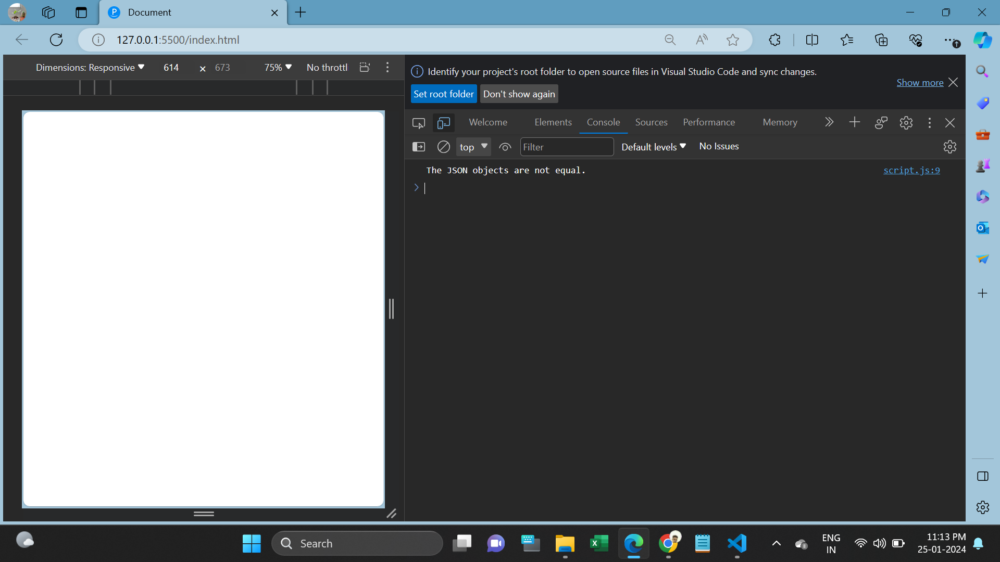
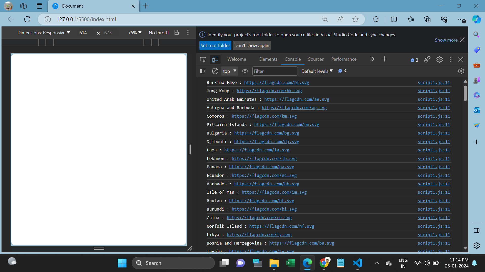
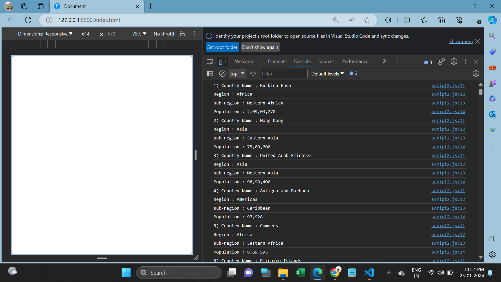

<h1>Task: 3</h1>

1. How to compare two JSON have the same properties without order. (script.js)

2. Use the rest countries API URL ->https://restcountries.com/v3.1/all 
and display all the country flags in the console. (script1.js)

3. Use the rest countries API URL ->https://restcountries.com/v3.1/all 
and display all the countries name, regions, sub-region ,population in the console. (script2.js)
 

I'm using Stringify method to convert object into string then compared using if-else.

In rest countries API using XMLHttpRequest method to get data from the API and then printing flags, countries name, regions, sub-region and population in console.

<h2>Screenshots</h2>

1. Script.js Result

 

2. Script1.js Result

 

3. Script2.js Result

 
